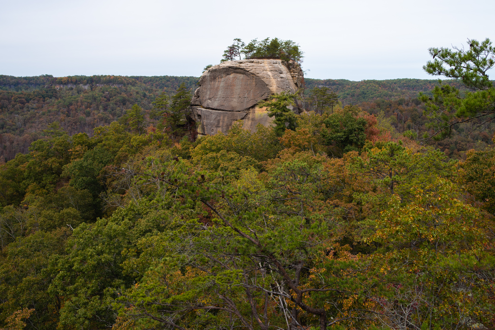

# Red River Gorge Project 
## GEO 409 in Fall of 2019
## By: Beth Ann Winebarger

This project explores the uses of Arc Pro and Python to create products featuring a few landmarks in the Red River Gorge

Red River Gorge is located in eastern Kentucky in the Daniel Boone National Forest. It is world-renowned for its rock climbing and geological features!

    
*View of Courthouse Rock*

## Links to project maps and assets

* [3D map of Courthouse Rock](https://Winebarger.github.io/RRG2/3d)
* [Estimated cliff heights](Elevation/Lab7_300DPI.jpg) for Courthouse Rock
* [Field trip to Red River Gorge](basemap/)
* [Contour Map for Princess Arch](https://Winebarger.github.io/RRG2/map-pa)

    
*Point cloud for Courthouse Rock rendered with Potree [click to view](https://Winebarger.github.io/RRG2/3d)*

    
*Mapbox map of major arches of the United States [click to view](https://Winebarger.github.io/RRG2/map-pa)*

