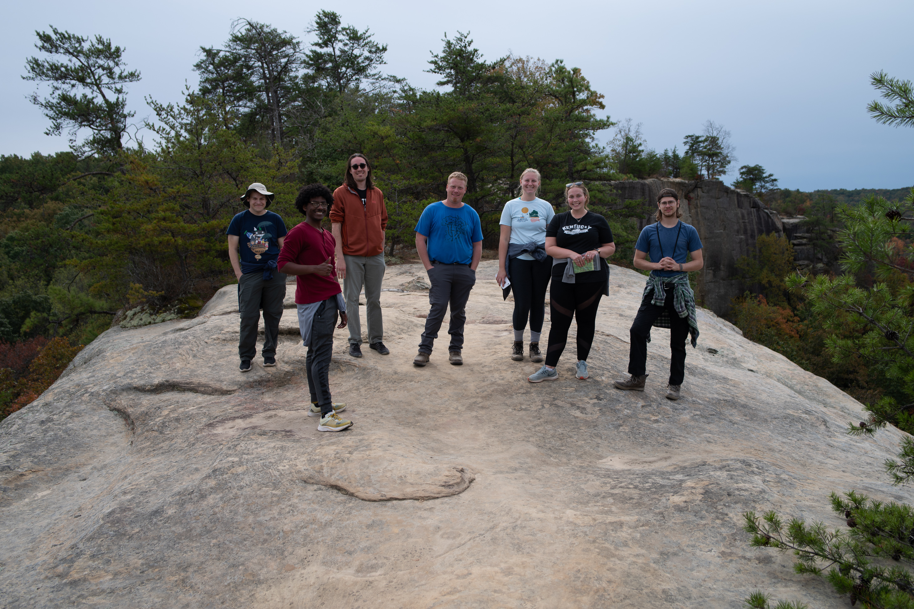
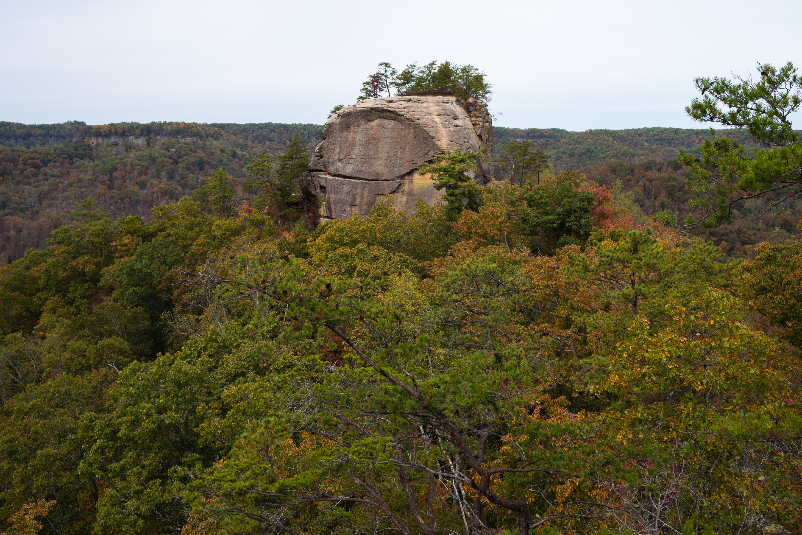
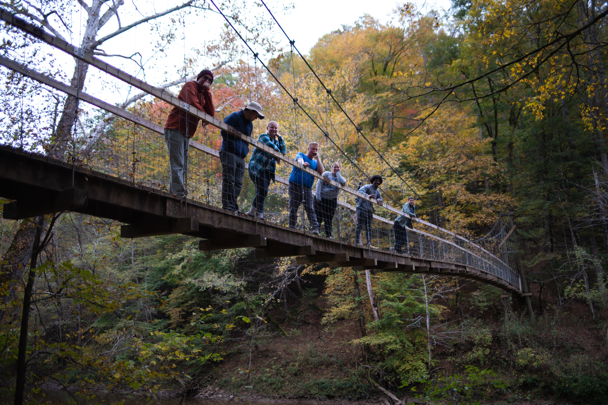
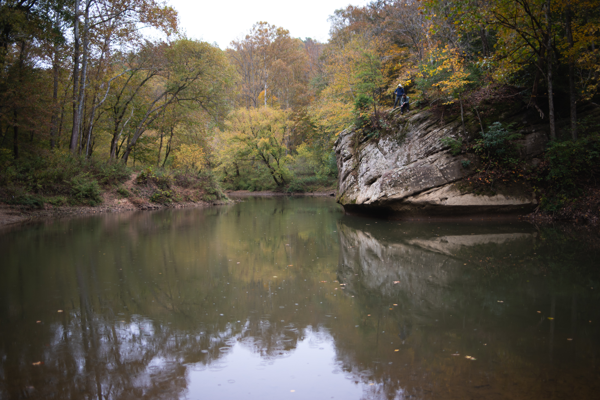
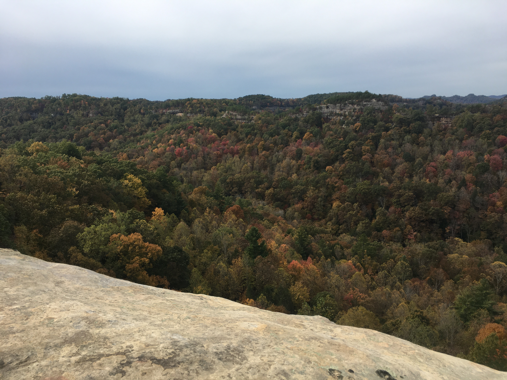

# Field Report
## Beth Ann Winebager
## Trip Date: October 25th, 2019
## Visited Courthouse Rock and Jump Rock in the Red River Gorge located in eastern Kentucky in the Daniel Boone National Forest

I decided to focus on Courthouse Rock for my project
In the field, we estimated the rock to have apx 90 foot cliff height and its shape is fairly blocky with steep (nearly vertical) sides. 

Prior to conducting the field work, I created a basemap for the area that I then loaded into Avenza Maps to guide my field work. The basemap was fairly accurate to the features I saw in the field!

## Here are some images from field work:

(The `../` means 'go up one directory'.)